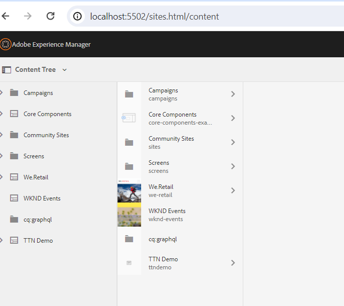
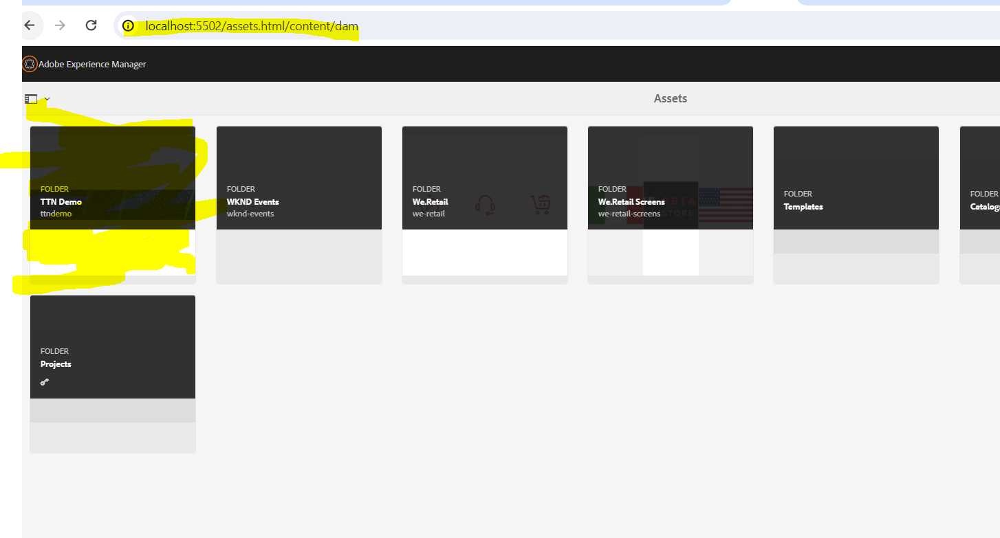

Question 4 4.
a) How do you check all sites deployed on aem instance
b) How do you check assets uploaded on aem instance
Answer :

1 - Navigate to the Sites Page: http://localhost:4502/sites.html/content. Your Site must be visible

2- Navigate to the Asset Page :http://localhost:4502/assets.html/content/dam Your assests are visible for the Project.
