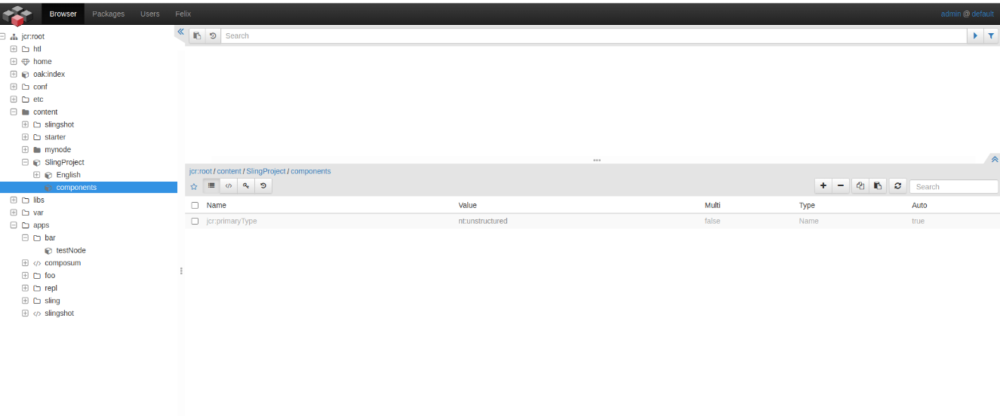

#### Question 2 -How Sling will Call the Script on the basis of url.
Answer :
We have a Url http://localhost:4502/content/example/sample.print.a4.html

Breakdown of URL Components

Path: /content/example/sample - This refers to the content path in the repository.

Selectors: print.a4 - These are additional request attributes used to refine the request.

Extension: html - This typically specifies the format of the response.

Resource Type: example/sample - This is the sling:resourceType of the resource located at the given path.

Sling splits url for different necessary information from URL. Then Sling repository(JCR) looks for the request resource.
Sling breaks a url in different parts like protocal, host, content path, selector(s) etc, and from the content path and extension sling look for the resource, if resource is not present at the
content path sling looks for the resourceType to serve the request.

##### Qestion 1: Example 2(b): Have a page /content/SlingProject/English/test.html which has resourceType    SlingProject/components/page/basepage

step 1 -> Go to the http://localhost:8080/bin/browser.html/ and select conetnet directory from the structure. then click on add icon (+) botton in the down left corner.
fill the fields as maintioned below:
Primary Type -> nt:unstructured
New Node Name -> SlingProject

step 2 -> Go to the http://localhost:8080/bin/browser.html/ and select conetnet/SlingProject directory from the structure. then click on add icon (+) botton in the down left corner.
fill the fields as maintioned below:
Primary Type -> nt:unstructured
New Node Name -> English

step 3 -> Go to the http://localhost:8080/bin/browser.html/ and select conetnet/SlingProject/English directory from the structure. then click on add icon (+) botton in the down left corner.
fill the fields as maintioned below:
Primary Type -> nt:file
New Node Name -> test.html

step 4 -> Go to the http://localhost:8080/bin/browser.html/ and select conetnet/SlingProject/English/test.html directory from the structure. then click on add icon (+) botton in center dilog box where all the prior properties are present.
fill the fields as maintioned below for both the properties:
name -> sling:tresourceType
value -> SlingProject/components/page/basepage

##### Qestion 1: Example 2(c): We have 4 script files at “SlingProject/components/page/basepage”:

##### basepage.html.jsp

##### basepage.jsp

##### html.jsp

##### GET.jsp

step 1 -> Go to the http://localhost:8080/bin/browser.html/ and select conetnet/SlingProject directory from the structure. then click on add icon (+) botton in the down left corner.
fill the fields as maintioned below:
Primary Type -> nt:unstructured
New Node Name -> components

step 2 -> Go to the http://localhost:8080/bin/browser.html/ and select conetnet/SlingProject/components directory from the structure. then click on add icon (+) botton in the down left corner.
fill the fields as maintioned below:
Primary Type -> nt:unstructured
New Node Name -> page

step 3 -> Go to the http://localhost:8080/bin/browser.html/ and select conetnet/SlingProject/components/page directory from the structure. then click on add icon (+) botton in the down left corner.
fill the fields as maintioned below:
Primary Type -> nt:unstructured
New Node Name -> basepage

step 4 -> Go to the http://localhost:8080/bin/browser.html/ and select conetnet/SlingProject/components/page/basepage directory from the structure. then click on add icon (+) botton in the down left corner.
fill the fields as maintioned below:
Primary Type -> nt:file
New Node Name -> basepage.html.jsp

step 5 -> Repeat 4 step with below values.
Primary Type -> nt:file
New Node Name -> basepage.jsp

step 6 -> Repeat 4 step with below values.
Primary Type -> nt:file
New Node Name -> html.jsp

step 7 -> Repeat 4 step with below values.
Primary Type -> nt:file
New Node Name -> GET.jsp

