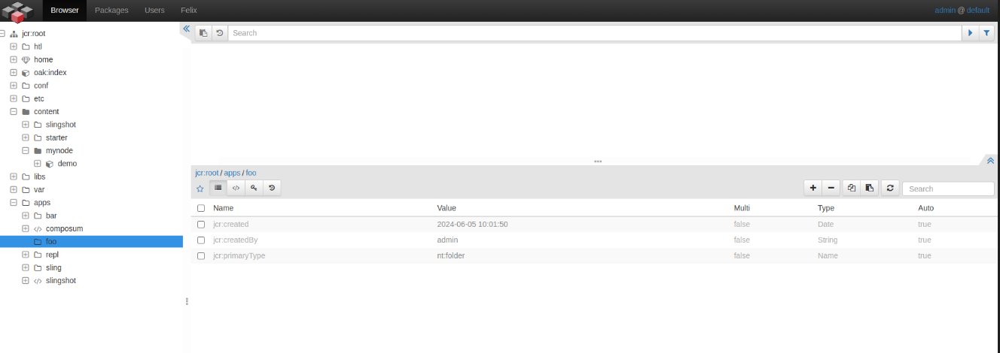
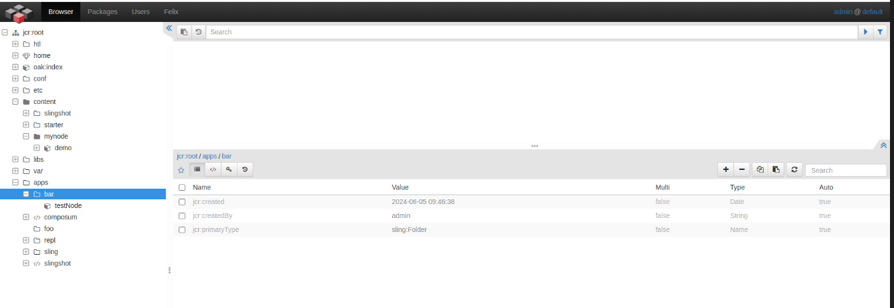
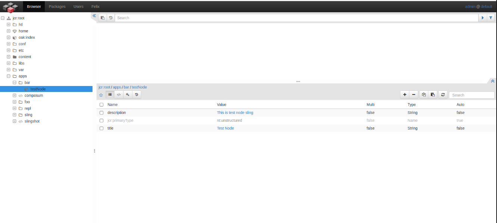
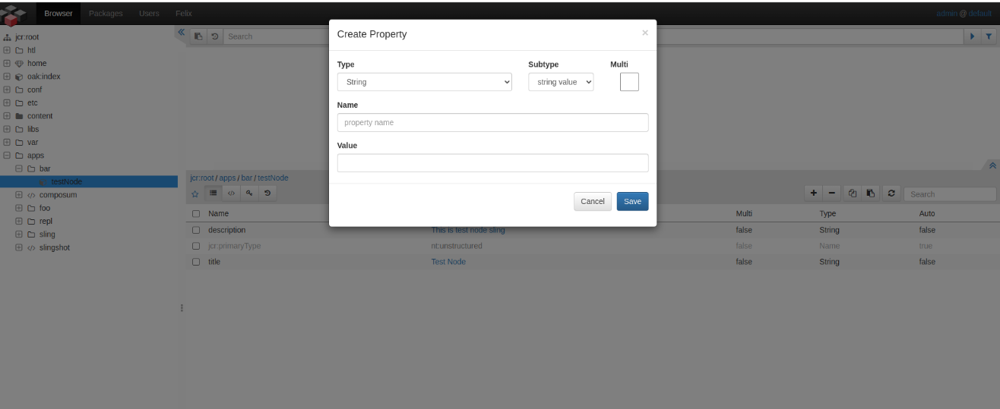

###### 2] Create this structure in sling console,

######  /apps

###### /foo - nt:folder

###### /bar - sling folder
######  testNode - nt:unstructured

###### = properties

######           title->Test Node                 

######           description-> This is test node sling

step 1 -> Go to the http://localhost:8080/bin/browser.html/ and select app directory from the structure. then click on add icon (+) botton in the down left corner.
fill the fields as maintioned below:
Primary Type -> nt:Folder
New Node Name -> foo

step 2 -> Go to the http://localhost:8080/bin/browser.html/ and select app directory from the structure. then click on add icon (+) botton in the down left corner.
fill the fields as maintioned below:
Primary Type -> sling:Folder
New Node Name -> bar

step 3 -> Go to the http://localhost:8080/bin/browser.html/ and select app/bar directory from the structure. then click on add icon (+) botton in the down left corner.
fill the fields as maintioned below:
Primary Type -> nt:unstructured
New Node Name -> testNode

step 4 -> Go to the http://localhost:8080/bin/browser.html/ and select app/bar/testNode directory from the structure. then click on add icon (+) botton in center dilog box where all the prior properties are present.
fill the fields as maintioned below for both the properties:
name -> title
value -> Test Node
step 5 -> repeat the step 4 with below values.
name -> description
value -> This is test node sling

