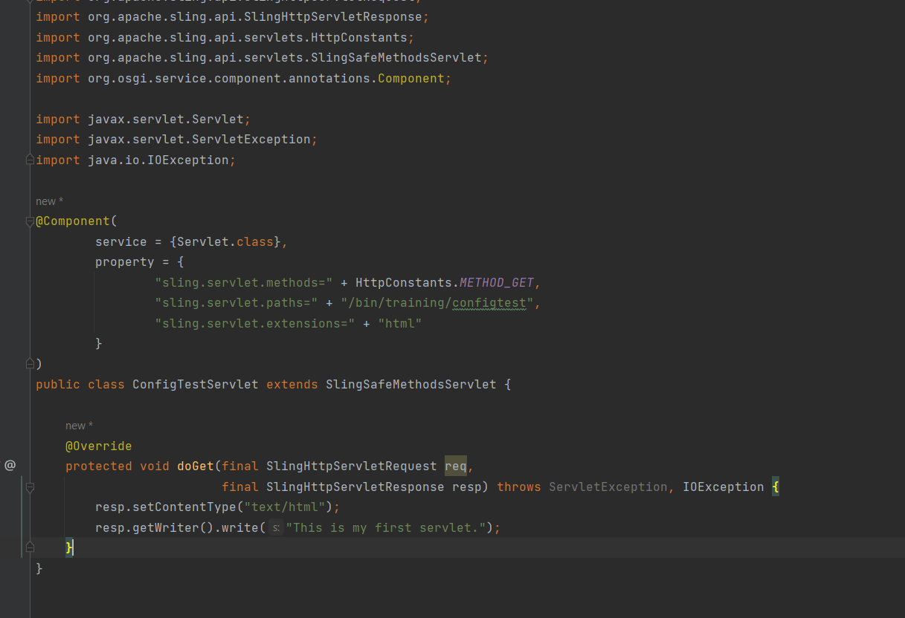
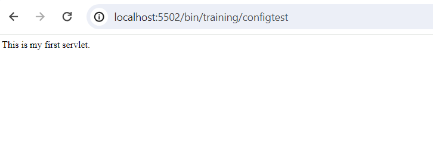

##### Create a servlet and register it on path /bin/training/configtest and extension as html, method as GET. It should print the hardcoded message "This is my first servlet."

##### Solution

Accessing localhost:5502/bin/training/configtest gives desired output.

