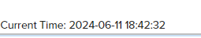

#### Question1: Print current time.

Step1 Create java File 

~~~~
package com.example.core.models;

import com.adobe.cq.sightly.WCMUsePojo; import java.text.SimpleDateFormat; import java.util.Date;

public class CurrentTime extends WCMUsePojo {

private String currentTime;

@Override
public void activate() throws Exception {
SimpleDateFormat formatter = new SimpleDateFormat("yyyy-MM-dd HH:mm:ss");
Date date = new Date();
currentTime = formatter.format(date);
}

public String getCurrentTime() {
return currentTime;
}
}
~~~~

Step 2 Create htl file 

Current Time: ${name.currentTime}

