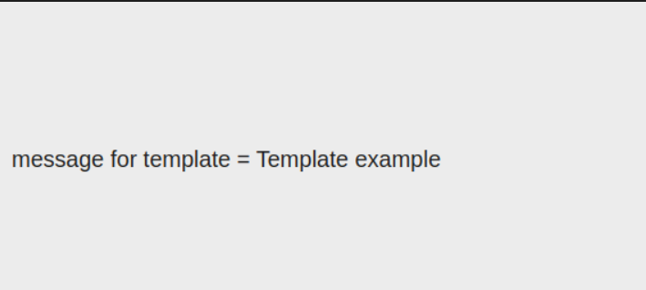

#### Question2: Write a Sightly template named pageTitleTemplate that takes a single parameter title and renders it within an h1 tag.

Answer: 

Step 1: Create a template as pageTitleTemplate.html

#### < template data-sly-template.include="${@ message}">
####   
 message for template = ${message} 

#### < /template>

Step 2: Include the template into the component.

#### <sly data-sly-use.temp="${'pageTitleTemplate.html'}"
#### data-sly-call="${temp.include @ message='Template example'}"/>

