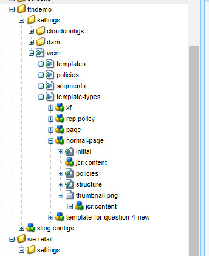
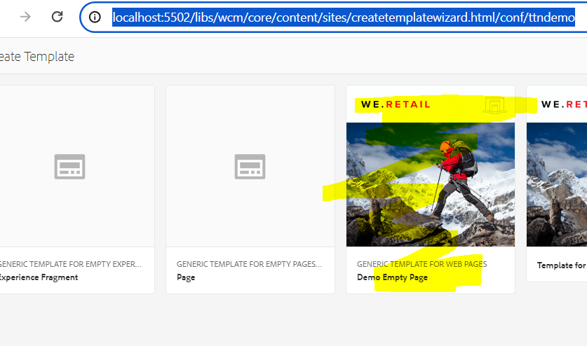
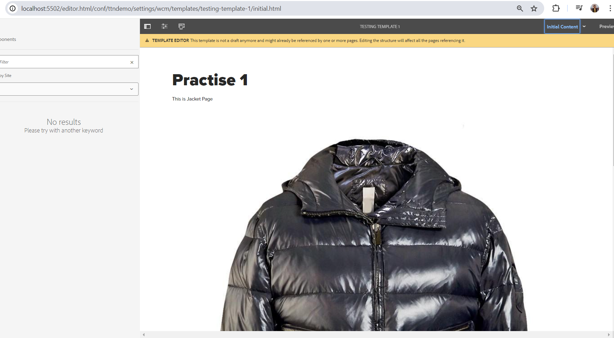

#### Question 1 : Create a template from custom template type.

#### Answer - 
First we need to create a template type . To create template type .
1 - copy a template type from existing We retail project

 Path of existing template /conf/we-retail/settings/wcm/template-types/empty-page
 
2- Paste the template type inside ttndemo project Template type and change the name to normal-page 

3 - Now  we created Template type and it is visible inside TTN Demo template types

4 - Using this Template Time create New template

In template accept the Page level and componenet level policy now add components
Add components template is created
