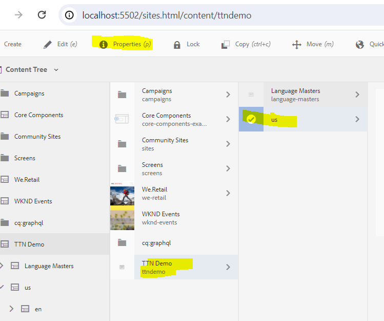
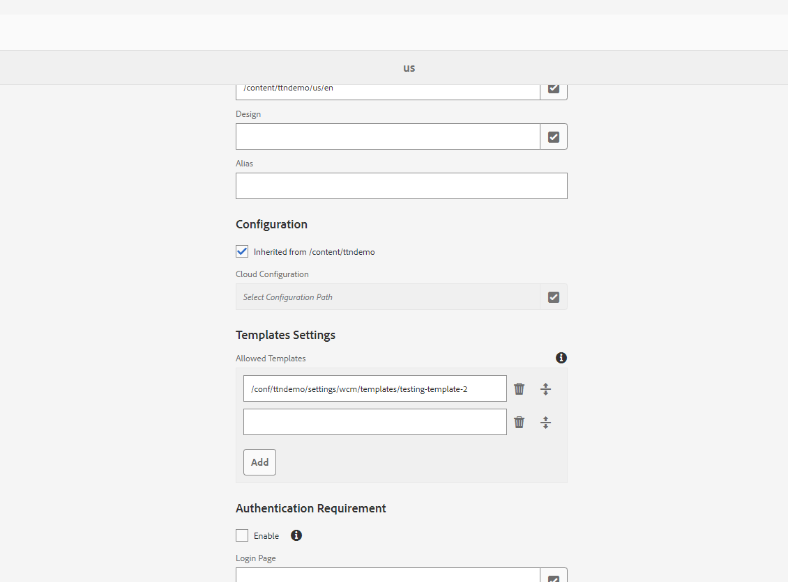
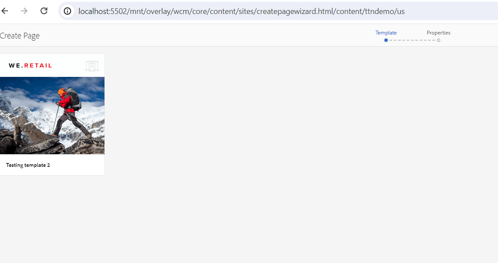
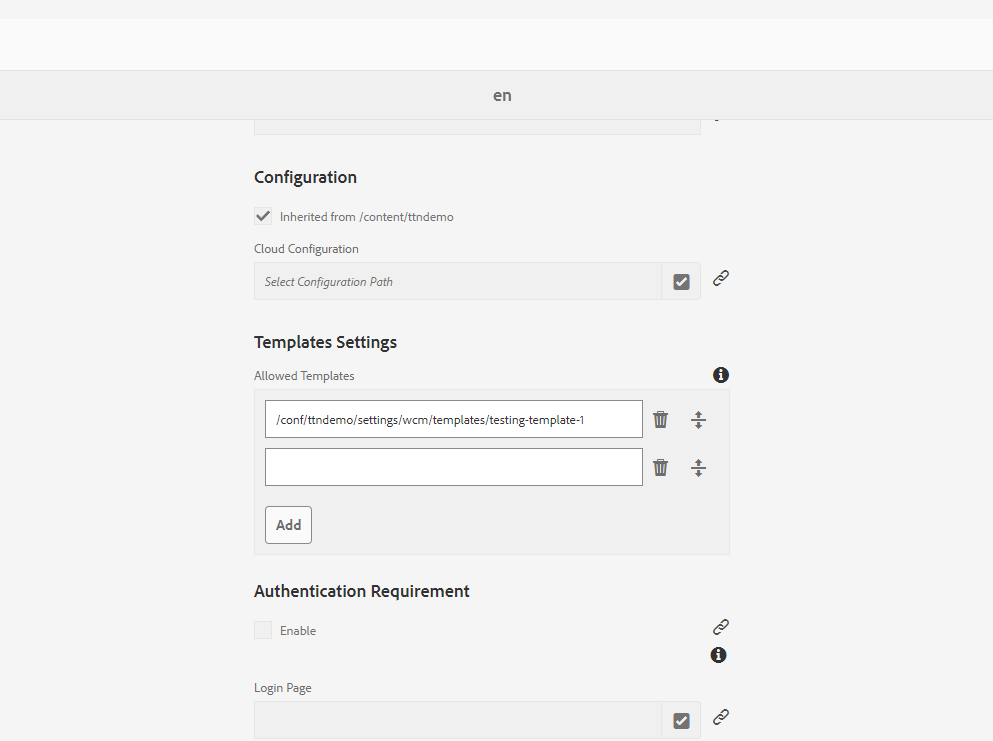
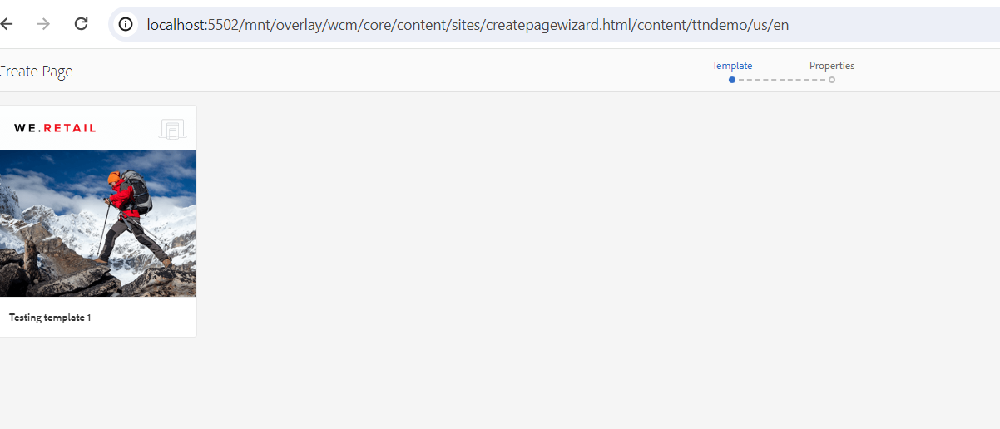

##### Create two templates T1 and T2 such that T1 is only allowed under hierarchy “/content/my-site/us” and T2 is only allowed under “/content/my-site/fr”

Create two Templates Template Testing 1 and Template testing 2

1 - Now go to TTN Demo and Us now go to properties 

2 - In properties Go to Advance 

In template type add specific template only

3 - Now only Template 2 is visible while creating page on us

Similarly add  specific template T1 in en

Now only template 1 is visible on en while creating page

