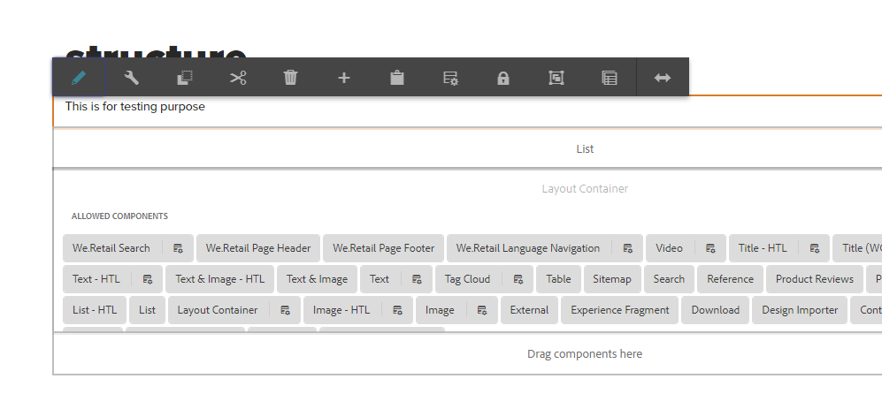

Add a component on a template such that the content (authored properties) of the component remains exactly same on all the pages created using that template.

Add The component Title And lock the component on Structure . Now all the page created using this template will be visible on page and also cannot be changed

As this text field is locked it cant be changed on pages
