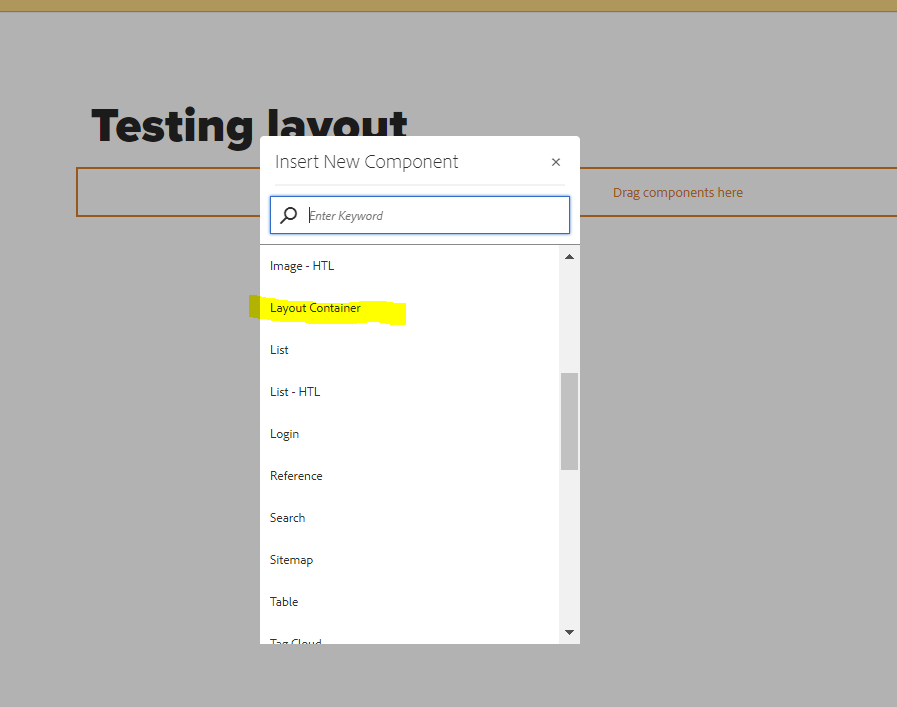
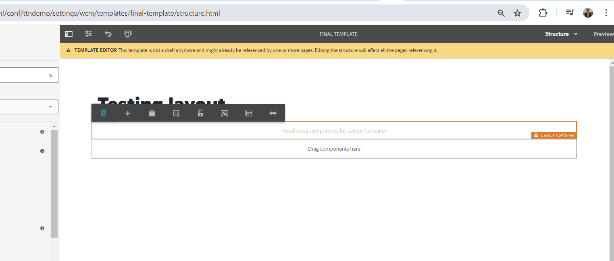
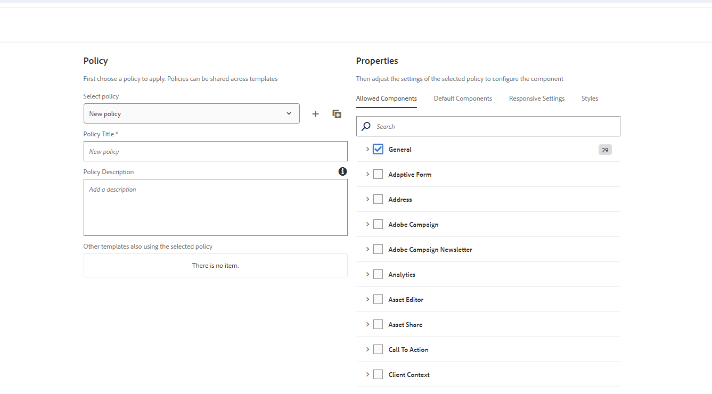
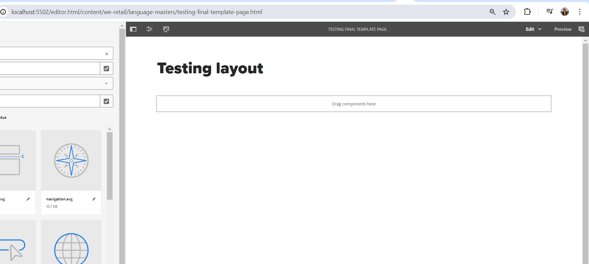

###### Add a parsys (responsive grid/layout container) in the above template such that author can add any component from group “General” on the page.

1 - Add layout container on template

2 - Now after adding Unlock the container . It will say not allowed

3 - Add Policy in child Container

4 - Now Layout container componets are visible . Now unlock the template and create page using this Template

5 - create page using this Template. Now on the page Layout  is visible

