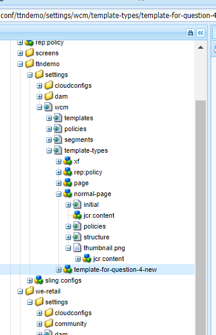
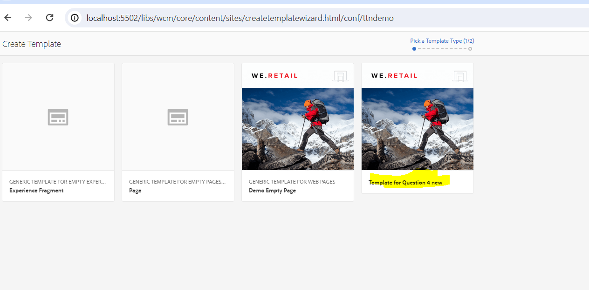
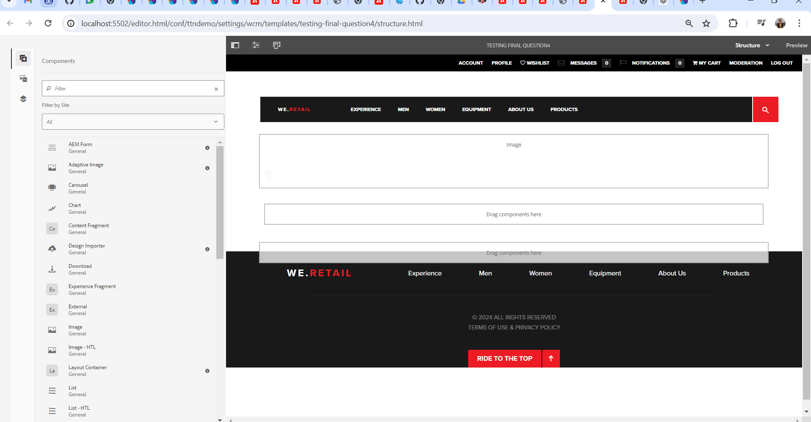

##### Define a component in such a way that content remains same on all pages created using a common template and the authored content can be reused on other templates as well without any re-authoring of the content

1 - Create A template template-for-question-4-new 
2 -add Header and footer and One image in Template
3 - Now go to crx/de
4 -cut the template template-for-question-4-new and paste it in Template types 

5 - Now Template type is visible containg Header footer and Image and all the templates create using this template type will have that

6 - Now if we create page using this template they will have these components

