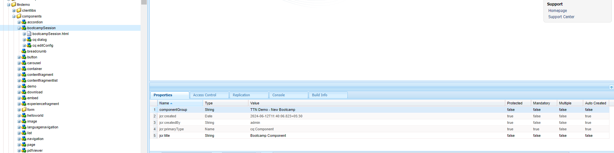
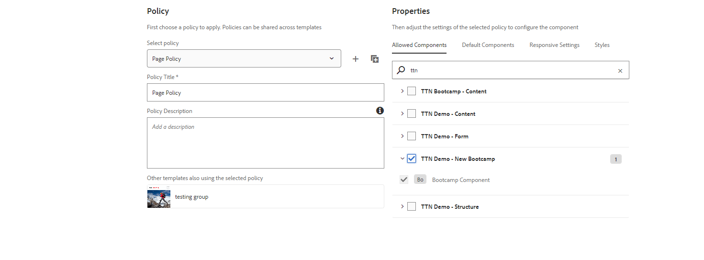
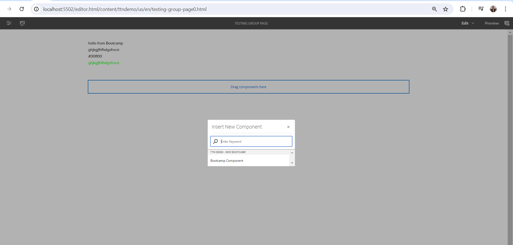

##### Change the component Group to any custom name of your choice and then try dragging and dropping these component onto any page and try analyzing the dialogs (both on CRXDE and UI)

#### Answer 

Answer: Initially the component group of bootcampSession component was TTN Demo - Content, and we changed it to TTN Demo - New Bootcamp. As result we are unable to add that component due to the group update.

If we want to use that component on any page now we are required to add group TTN Demo - New Bootcamp into the allowed group under the Policy of that template.

Add Group in template

Now we can use that component in page created using template

