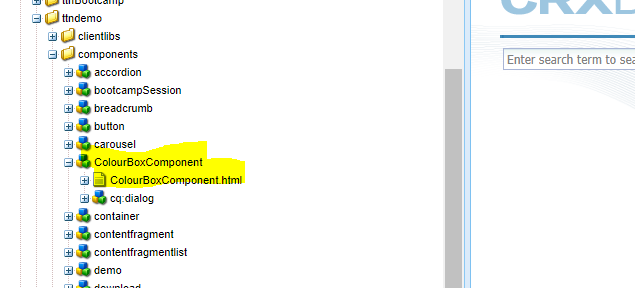
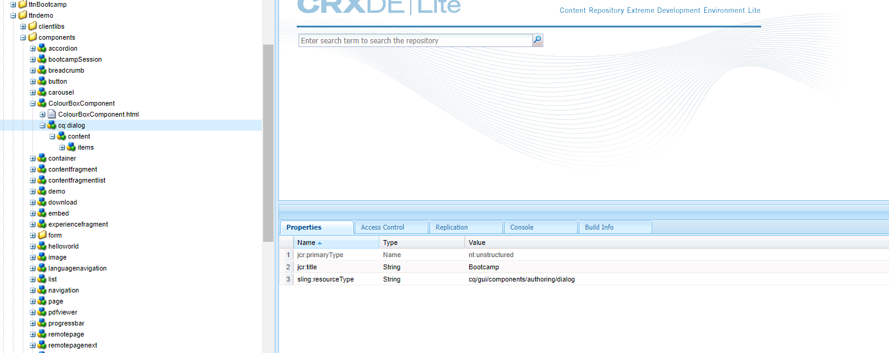
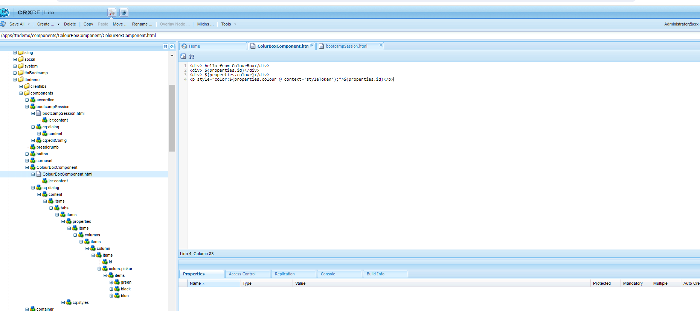
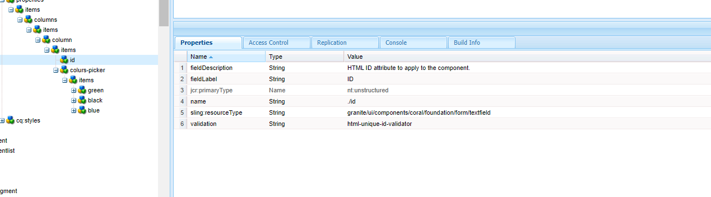
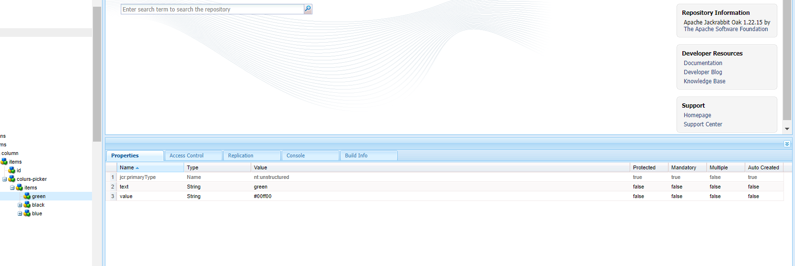
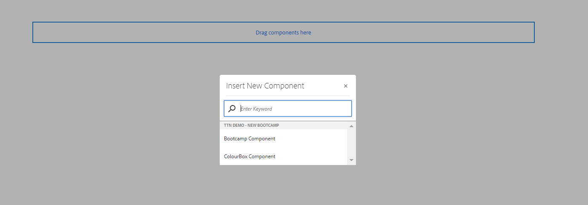
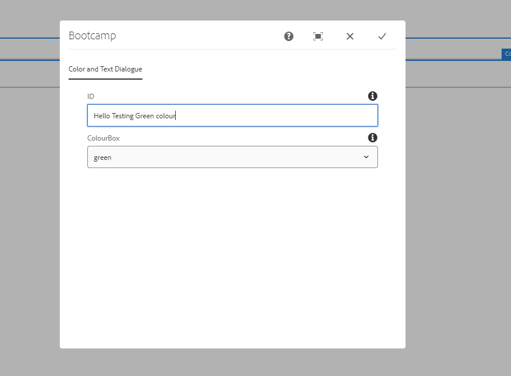
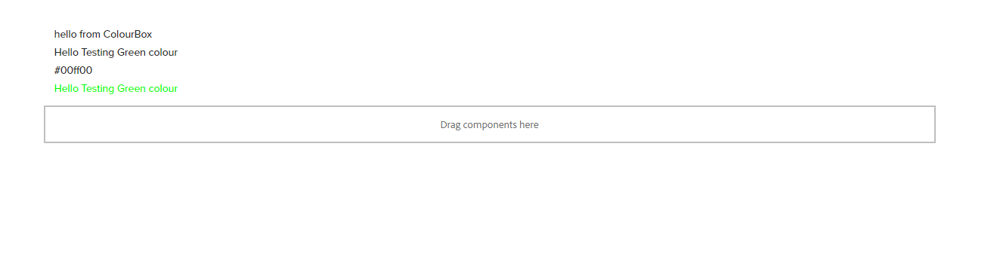

##### Question 1: Create a component with a dialog and having color drop down (green, blue, black etc) and one rich text editor for authoring text. This component is supposed to render text and apply chosen color to text.

Step 1: create a node(colourboxcomponent) with primaryType cq:component and create a html file into that.

Step 2: Create a node with name cq:dialog into the component node of type nt:unstructured and add property sling:resourceType with value cq/gui/components/authoring/dialog, jcr:title with value Properties.

Step3 : create structure in cq:dialog and Html

 Step4 : create Id  and colourpicker define properties as shown

Step5 : Drop the componenet on page

Step6 :open diaglogue box give text in Id and choose colour

 
Step 7 : desired out in colour selected

